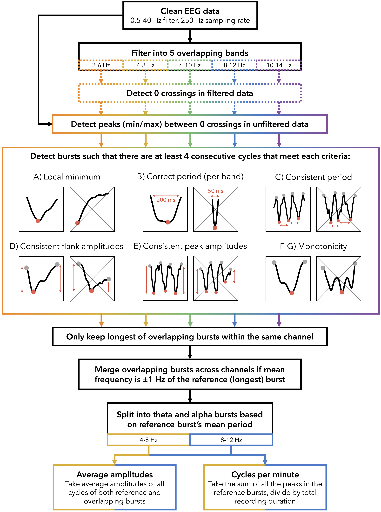

# Matcycle
 
 This is a repository of functions that detect EEG oscillation bursts based on the shape and periodicity of the signal. It is a MATLAB implementation of the cycle-by-cycle analysis outlined by [Cole & Voytek, 2019](https://journals.physiology.org/doi/full/10.1152/jn.00273.2019) originally created in [python](https://github.com/bycycle-tools/bycycle).

It was first used in *How and when EEG reflects changes in neuronal connectivity due to time awake*, by Snipes et al. 2023, iScience, applied in the repository [Theta_Bursts](https://github.com/snipeso/Theta_Bursts).

## How it works

For more details, see [Snipes et al. (2023)](https://doi.org/10.1016/j.isci.2023.107138).

## How to use

### Set up first time
1. Add the Matcycle folder to the MATLAB paths. Either:
  - run `addpath("{path}/Matcycle")`
  - Using the GUI, in Home > Set path > add folder (N.B. don't use "add subfolers")

### Incorporate into scripts

See [Example.m](Example.m).

1. Filter clean EEG data into narrow overlapping bands
2. Run `cycy.detect_bursts()` to get a struct with all the detected bursts in the EEG recording.
3. Run `cycy.aggregate_bursts()` to aggregate bursts in different channels overlapping in time by phase coherence, or `aggregateBurstsByFrequency()` to aggregate bursts by burst frequency (recommended).
4. Run `cycy.plot_all_bursts()` to see how well the detection went.

Optional:
4. Run `cycy.burst_shape_properties()` then `cycy.burst_averages()` to get all sorts of properties of the reference burst (the longest from those aggregated across channels), like how peaky it is
5. Run `cycy.classify_bursts_shape()` to sort bursts into shapes, like "sawtooth" or "sinusoid".

## How to adapt
Modify the example script burst thresholds, and run the lines under `%DEBUG`. It will apply the burst detection to a single channel, then plot it, from which you can see how well it does.

# Glossary

- **narrowband** / **broadband** filtered data
- **original** / **inverted**
- **zero crossings** (of narrowband data)
- **peaks**: max/min between ZC of broadband data
- **midpoints** between positive and negative peaks
  - **falling edge** and **rising edge**
- **cycles**: falling-edge-midpoint to falling-edge-midpoint
- **properties**: of cycles (frequency, ratio of falling/rising edges, etc.)
- **criteria**: conditions the properties of each cycle has to meet to make it into a burst. Each criteria indicates a value, and the cycle has to hae a property above that value to be part of a burst.
- **criteria set**: a set of criteria that have to all be fullfiled for cycles to be included in a burst
- **burst**: set of consecutive cycles that match all criteria in a given criteria set in a single channel
- **burst cluster**: set of bursts that overlap in time across multiple channels with similar frequencies

# Coding conventions
- function names are `snake_case`
- Variable names are `CamelCase`
- The path of folders should be called `ImportantDataDir`
- The path of a file should be called `DataPath`
- indexes should be `idxThisAndThat`
